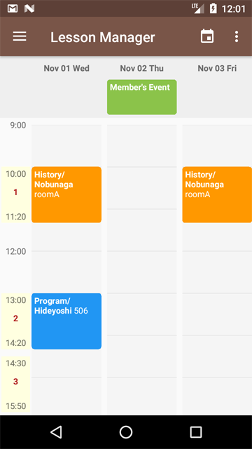

# LessonManager
Lesson management application for teachers to provide courses and activities.
The app supports devices running Android 7.0+, and is optimized for phones only.



## Source
The source code in this repository reflects the app as Google Play Application.

## Getting Started
This project uses FireBase analytics.
If you are not using Firebase, create an account.
Place `google-service.json` in the following location.

```
[project-home]/app/google-service.json
```

## Features
With the app, you can:
- You can set the timetable of your lesson.
- You can get your members from the contact book.
- You can define regular courses for each member.
- You can manage the change of date and time, absence, and suspende for each member.
- You can register events.

## Library
- [Dagger2](https://github.com/google/dagger "Dagger2") 
- [RxJava2](https://github.com/ReactiveX/RxJava "RxJava2")
- [orma](https://github.com/maskarade/Android-Orma "Orma")
- [Android Week View](https://github.com/alamkanak/Android-Week-View "Android Week View")
- [itemtouchhelper-extension](https://github.com/loopeer/itemtouchhelper-extension "itemtouchhelper-extension")

## Development environment
- Windows7 x64
- Android Studio v3.0.0

## Copyright
    Copyright 2017 manavista. All rights reserved.

    Licensed under the Apache License, Version 2.0 (the "License");
    you may not use this file except in compliance with the License.
    You may obtain a copy of the License at

        http://www.apache.org/licenses/LICENSE-2.0

    Unless required by applicable law or agreed to in writing, software
    distributed under the License is distributed on an "AS IS" BASIS,
    WITHOUT WARRANTIES OR CONDITIONS OF ANY KIND, either express or implied.
    See the License for the specific language governing permissions and
    limitations under the License.
